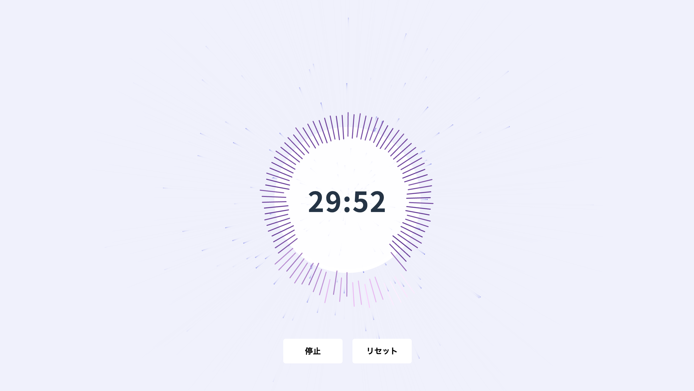

---
> **_Visualize your time. Amplify your focus._**

「Pomodify」は、音と映像のビジュアルエフェクトを組み合わせ、集中力を最大化する次世代型ポモドーロタイマーです。
生産性を楽しみながら向上させる、新しい体験をお届けします。

<br/>

## 🎯 **主な特徴**

- 🎵 **オーディオビジュアライゼーション**

  タイマーの進行状況を音と映像でリアルタイムに表現し、作業に没入感をプラス。

- 🛠️ **カスタマイズ可能なタイマー設定（Comming soon）**

  ~~作業時間や休憩時間を自由に設定~~して、あなたのワークフローにぴったりフィット。

- 💎 **直感的で美しいデザイン**

  クリーンでモダンなインターフェースで、使いやすさと美しさを両立。

<br/>

## 🚀 **ローカルでの立ち上げ方**

以下の手順で、Pomodify をローカル環境でセットアップできます。

### ⚙️ **必要な環境**

- **Node.js**: 推奨バージョン 18.x
- **npm** または **yarn**
- **Git**

### 💻 **手順**

1. **リポジトリをクローンする**

   ```bash
   git clone https://github.com/yuuuda1/Pomodify.git
   cd Pomodify
   ```

2. **依存関係をインストールする**

   ```bash
   npm install
   # または
   yarn install
   ```

3. **開発サーバーを起動する**

   ```bash
   npm run dev
   # または
   yarn dev
   ```

4. **ブラウザでアプリを開く**

   開発サーバーが起動したら、以下の URL にアクセスします：

   ```
   http://localhost:5173
   ```

   🎉 **作業完了です！Pomodify の世界へようこそ！**

<br/>

## 🛠️ **開発のポイント**

- **フレームワーク**:
  - React + TypeScript + Vite に基づいた最新の技術スタックを採用。

- **開発体験**:
  - ホットモジュールリプレースメント (HMR) を活用して、スムーズなコーディングを実現。

- **コード品質**:
  - ESLint を導入済みで、コードの一貫性を保証。

<br/>

## 🌍 **貢献について**

一緒に Pomodify を進化させませんか？
バグ報告やアイデアの提案は、ぜひ [Issues](https://github.com/yuuuda1/Pomodify/issues) でお知らせください！
プルリクエストも大歓迎です！💪

<br/>

## 📸 **スクリーンショット**

### タイマー画面
> _「視覚と音で時間を感じる新しい方法」_



<br/>

## 🎉 **さあ、Pomodify を始めよう！**
「誰もが気軽に音楽を聴きながらポモドーロタイマーを利用できる」
**Pomodify** は、あなたの生産性の新しい相棒です。
